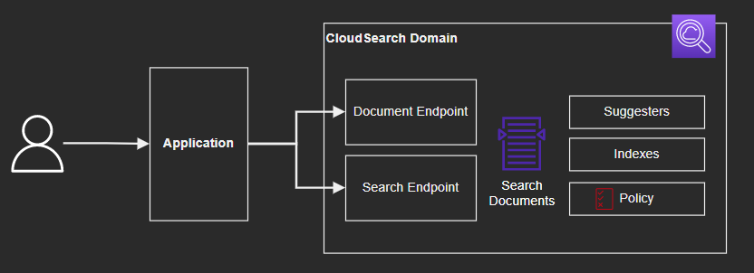

# AWS CloudSearch



## Infrastructure
Create the infrastructure:

```sh
terraform init
terraform apply -auto-approve
```

Terraform will also create the search indexes.

## Search

### Upload documents

Upload the file batch:

```sh
aws cloudsearchdomain upload-documents \
  --endpoint-url $documentEndpoint \
  --content-type 'application/json' \
  --documents 'movies-batch.json' \
  --region 'us-east-1'
```

### Send a search

Search with a query:

```sh
aws cloudsearchdomain search \
  --endpoint-url $searchEndpoint \
  --search-query 'Matrix' \
  --region 'us-east-1'
```

### Get suggestions

Create a suggester:

```sh
aws cloudsearch define-suggester \
  --domain-name 'movies-domain' \
  --suggester 'SuggesterName=movie_suggester,DocumentSuggesterOptions={SourceField=title,FuzzyMatching=none}' \
  --region 'us-east-1'
```

Index the documents again:

```sh
aws cloudsearch index-documents \
  --domain-name 'movies-domain' \
  --region 'us-east-1'
```

Retrieves autocomplete suggestions for a partial query string:

```sh
aws cloudsearchdomain suggest \
  --endpoint-url $searchEndpoint \
  --suggest-query 'Matrix' \
  --region 'us-east-1'
```
